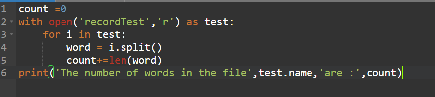
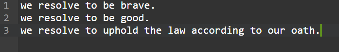
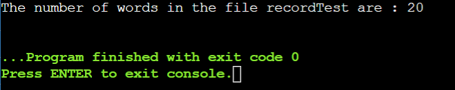

# Word-count
## AIM:
To write a python program for getting the word count from a text.
## EQUIPEMENT'S REQUIRED: 
PC
Anaconda - Python 3.7
## ALGORITHM: 
### Step 1:Open file in read mode.

### Step 2:Read the text using read function. 
 
### Step 3:Split the text using space separator. 

### Step 4:The length of the splitn list should be equal to the number of words in the text file.  

### Step 5:Now give print(). 

### Step 6:End the program. 

## PROGRAM:
count =0
with open('recordTest','r') as test:
    for i in test:
        word = i.split()
        count+=len(word)
print('The number of words in the file',text.name,'are :',count)

### OUTPUT:

## RESULT:
Thus the program is written to find the word count from a text.
